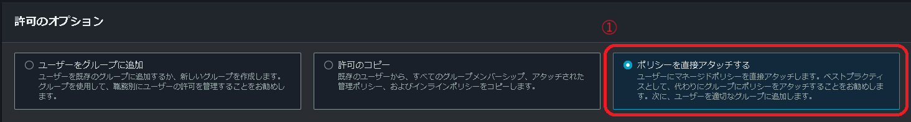
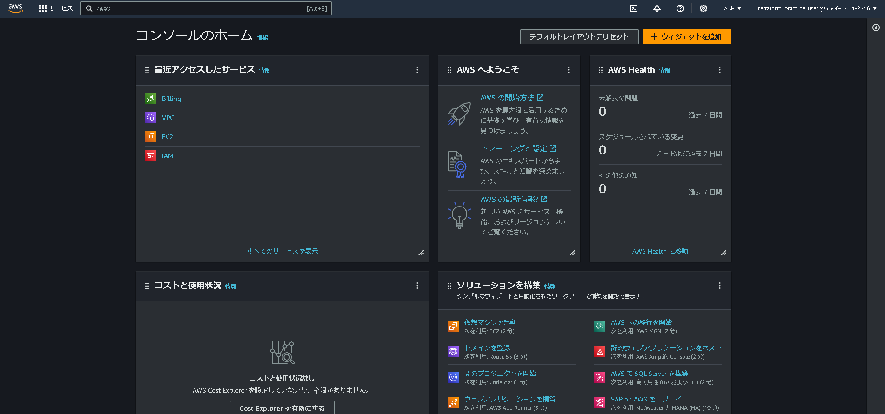

# 第1章　セットアップ
本章では、Windowsを前提に、AWSとTerraformのセットアップを行う。<br />
Terraform専用のIAMユーザーを作成してアクセスキーを払い出し、AWS CLIとTerraformをインストールする。

## 1.1 AWS
AWSでIAMユーザーを作成し、アクセスキーを払い出す。<br />
あわせてAWS CLIをインストールし、コマンドラインからAWSのAPIを操作できるようにする。

### 1.1.1 IAMユーザー
Terraform用のIAMユーザーを作成する。<br />
WebブラウザからAWSマネジメントコンソールのIAMに移動し、「➀ユーザー」「➁ユーザーを追加」の順にクリックする。

#### 図1.1 IAM

 

「➀ユーザー名」を入力し、「➁AWS マネジメントコンソールへのユーザーアクセスを提供する - オプション」をチェックして、ラジオボタンの「IAMユーザーを作成します」を選択し、「➂次へ」をクリックする。(図1.2)<br />

#### 図1.2 ユーザーの詳細設定


「➀ポリシーを直接アタッチする」をクリックし、「➁AdministratorAccess」をチェックして、「➂次へ」を選択する。(図1.3)

#### 1.3 アクセス許可の設定




タグは追加せず「➀ユーザーの作成」をクリックする。(図1.4)

#### 1.4 ユーザーの作成


すると、IAMユーザーが作成され、ユーザー名とアクセスキーが表示される
また、ユーザー情報はCSVファイルでもダウンロードが可能である。

#### 1.5 ユーザーの作成完了


作成したユーザーでIAMユーザーとしてログインできるか確認する。
開いている、WebブラウザからAWSマネジメントコンソールをサインアウトして、作成したIAMユーザーでサインインする(図1.6)

#### 1.6 IAMユーザーでのサインイン


サインインを押下すると、IAMでのAWSコンソール画面が表示される(図1.7)

#### 1.7 サインイン完了



### 1.1.2 AWS CLI

AWS CLIは、Pythonパッケージマネージャーのpip3からインストール可能
```
$ pip3 install awscli --upgrade
```

インストールが完了したら、AWS CLIのバージョンを確認する。
```
$ aws --version
aws-cli/2.9.15 Python/3.9.11 Windows/10 exe/AMD64 prompt/off
```
### 1.1.3 クレデンシャル

AWSマネジメントコンソールからアクセスキーIDとシークレットアクセスキーをコピーし、環境変数に設定する。<br />
環境変数を設定する際には、`~/.aws/credentials`内で、修正する
```
[terraform_practice_user]
aws_access_key_id = **********
aws_secret_access_key = **********
```

以下のコマンドを実行して、AWSアカウントIDが出力されれば、正しく設定されている。
```
$ aws sts get-caller-identity --query Account --output text
123456789012
```

なお「***AdministratorAccess***」ポリシーがアタッチされたアクセスキーの権限は強力である。<br />
間違っても流出しないよう、扱いには細心の注意を払うように。

## 1.2 Terraform
まず、WindowsでTerraformを利用したい場合は、[公式サイト](https://developer.hashicorp.com/terraform/install)から、実行ファイルをダウンロードする。

WindowsのAMD64を選択し、ダウンロードします。


バイナリーファイルのダウンロードが完了したら、Windowsの環境変数を設定し、
terraformコマンドが実行可能な状態で設定する。

設定完了後、`terraform -v`を実行し、現在インストールされているterraformのバージョン情報が表示されていれば、インストール完了である。
```
$ terraform -v
Terraform v1.6.4
on windows_amd64
```

これで基本的な、Terraformの設定が完了である。