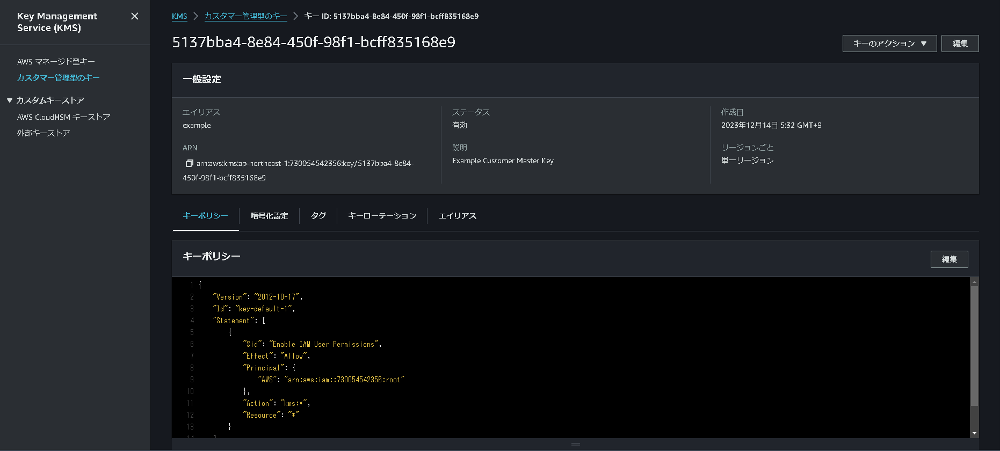

# 第11章 鍵管理
セキュリティ向上のため、ストレージやデータベースのディスク暗号化は必須である。<br />
暗号化のためには暗号鍵が必要であるが、一般的に暗号鍵の管理は煩雑である。そこでAWSでは、暗号鍵を簡単かつ安全に管理するソリューションとして**KMS(Key Management Service)**が提供されている。本章では、このKMSについて学習する。

## 11.1 KMS(Key Management Service)
KMSは暗号鍵を管理するマネージドサービスである。KMSで最も重要なリソースはカスタマーマスターキーである。<br />
KMSは暗号化戦略として、エンベロープ暗号化が採用されている。データの暗号化と復号では、カスタマーマスターキーを直接使わない。そのかわりに、カスタマーマスターキーが自動生成したデータキーを使用して、暗号化と復号を行う。<br />
KMSはAWSの各種サービスと統合されており、暗号化戦略を意識せず使える。単純にカスタマーマスターキーを指定すれば、自動的にデータの暗号化と復号を行うことができる。

### 11.1.1 カスタマーマスターキー
カスタマーマスターキーは、リスト11.1のように定義する。

リスト11.1: カスタマーマスターキーの定義
```
resource "aws_kms_key" "example" {
  description = "Example Customer Master Key"
  enable_key_rotation = true
  is_enabled = true
  deletion_window_in_days = 30
}
```

#### 概要
descriptionには、何の用途で使っているかを記述する。

#### 自動ローテーション
enable_key_rotationで自動ローテーション機能を有効にできる。ローテーション頻度は年に一度である。ローテーション後も、復号に必要な古い暗号化マテリアルは保存される。<br />
そのため、ローテーション前に暗号化したデータの復号が引き続き可能である。

#### 有効化と無効化
is_enabledをfalseにすると、カスタマーマスターキーを無効化できる。無効化後にあらためて有効化することもできる。

#### 削除待期期間
deletion_window_in_daysで、カスタマーマスターキーの削除待期期間を設定する。7~30日の範囲で指定可能で、デフォルトは30日である。待機期間中であれば、いつでも削除を取り消せる。<br />
なお、**カスタマーマスターキーの削除は推奨されない。**削除したカスタマーマスターキーで暗号化したデータは、いかなる手段でも復号できなくなる。そのため、通常は無効化を選択すべきである。

### 11.1.2 エイリアス
カスタマーマスターキーにはそれぞれUUIDが割り当てられるが、人間にはわかりづらいものである。そこでエイリアスを設定し、どういう用途で使われているか識別しやすくする。エイリアスはリスト11.2のように設定する。

リスト11.2: エイリアスの定義
```
resource "aws_kms_alias" "example" {
  name = "alias/example"
  target_key_id = aws_kms_key.example.key_id
}
```

なお、エイリアスで設定する名前には「**alias/**」というプレフィックスが必要である。<br />
やや分かりづらい制約なので、注意が必要。

terraform applyすると、「**カスタマーマスターキー**」が作成されているのが、確認できる。(図11.1)

図11.1: カスタマーマスターキー作成完了画面
