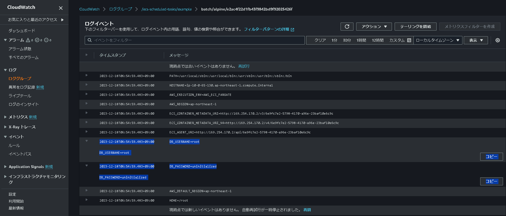
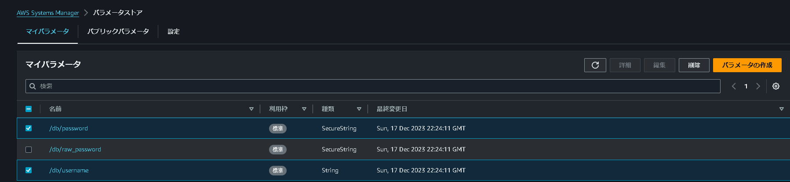

# 第12章 設定管理
データベース接続情報などの設定は環境によって異なる。本章では、環境ごとに異なる設定をどのように管理し、どうやって環境ごとに設定を切り替えるかを学習する。

## 12.1 コンテナの設定管理
ECSのようなコンテナ環境では、設定をコンテナ起動時に注入する。実行環境ごとに異なる設定には、次のようなものがある。<br />
- データベースのホスト名・ユーザー名・パスワード
- TwitterやFacebookなどの外部サービスのクレデンシャル
- 管理者あてのメールアドレス

なお、Railsのルーティング設定やSpringのDI設定のような、実行環境ごとに変化しない設定はアプリケーションコードと一緒に管理する。

## 12.2 SSMパラメータストア
SSMパラメータストアは、設定管理に特化したマネージドサービスであるい。設定は平文または暗号化したデータとして保存できる。

### 12.2.1 AWS CLIによる操作
まずはAWS CLIによるSSMパラメータストアの操作に慣れる。

#### 平文
SSMパラメータストアに値を保存するには、put-parametersコマンドを使う。平文で保存する場合は、--typeオプションに「**String**」を指定する。

```
$ aws ssm put-parameter --name 'plain_name' --value 'plain_value' --type String

{
    "Version": 1,
    "Tier": "Standard"
}
```

値を参照するには、get-parameterコマンドを使用する

```
$ aws ssm get-parameter --output text --name 'plain_name' --query Parameter.Value

plain_value
```

値を更新したい場合には初回保存時と同じく、put-parameterコマンドを使用する。ただし、「--overwrite」オプションが必要である。

```
$ aws ssm put-parameter --name 'plain_name' --type String --value 'modified value' --overwrite

{
    "Version": 2,
    "Tier": "Standard"
}

$ aws ssm get-parameter --output text --name 'plain_name' --query Parameter.Value

modified value
```

#### 暗号化
暗号化した値を保存する場合も、put-parameterコマンドを使う。平文と異なり、--typeオプションには「**SecureString**」を指定する。

```
$ aws ssm put-parameter --name 'encryption_name' --value 'encryption value' --type SecureString

{
    "Version": 1,
    "Tier": "Standard"
}
```

暗号化された値は、get-parameterコマンド「--with-decryption」オプションを追加すると、値を復号した状態で参照可能。

```
$ aws ssm get-parameter --output text --query Parameter.Value --name 'encryption_name' --with-decryption

encryption value
```

### 12.2.2 Terraformによるコード化
SSMパラメータストアはTerraformで管理することもできる。

#### 平文
/db/usernameのキー名で「root」という値を平文で保存する。リスト12.1のように定義する。

リスト12.1: データベースのユーザー名の定義
```
resource "aws_ssm_parameter" "db_username" {
  name = "/db/username"
  value = "root"
  type = "String"
  description = "データベースのユーザ名"
}
```

#### 暗号化
/db/raw_passwordのキー名で「VeryStrongPassword!」という値で暗号化して保存する。12.2のように定義する。

リスト12.2: データベースのパスワードの定義
```
resource "aws_ssm_parameter" "db_raw_password" {
  name = "/db/raw_password"
  value = "VeryStrongPassword!"
  type = "SecureString"
  description = "データベースのパスワード"
}
```

しかし、この方法を採用すると、暗号化する値がソースコードに平文で書かれてしまう。多くの場合、暗号化するような秘匿性の高い情報はバージョン管理対象外にすべきなので、このままでは使用できない。

#### Terraformによる初期値の設定とAWS CLIによる暗号化
そこで、「Terraformではダミー値を設定して、あとでAWS CLIから更新する」という戦略を採用する。例えば、リスト12.3のようにTerraformで実装する。

リスト12.3: データベースのパスワードのダミー定義
```
resource "aws_ssm_parameter" "db_password" {
  name = "/db/password"
  value = "uninitialized"
  type = "SecureString"
  description = "データベースのパスワード"

  lifecycle {
    ignore_changes = [value]
  }
}
```

このコードをapplyしたら、AWS CLIで更新する。

```
$ aws ssm put-parameter --name '/db/password' --type SecureString --value 'ModifiedStrongPassword!' --overwrite

{
    "Version": 2,
    "Tier": "Standard"
}

$ aws ssm get-parameter --output text --query Parameter.Value --name '/db/password' --with-decryption

ModifiedStrongPassword!
```

最終的に上書きするなら、コード管理は必要であるが、これは好みが出る。<br />
コード化しておくと、設定の変更理由がコミットログから追跡しやすくなる。また、外部サービスのクレデンシャルの発行方法など、ロストしやすい情報をコメントとして残す場所としても最適である。運用がやや面倒であるが、意外と有用な戦略である。

SSMパラメータストアの値を、ECSのDockerコンテナ内で環境変数として参照可能である。平文の値と暗号化した透過的に扱うことができ、ECSで意識する必要はない。ECSからSSMパラメータストアの値を参照する権限はリスト9.7で事前に付与している。では、リスト10.3のコンテナ定義を、リスト12.4のように変更する。

リスト12.4: コンテナ定義からSSMパラメータストアの値を参照
```
[
    {
        "name": "alpine",
        "image": "alpine:latest",
        "essential": true,
        "logConfiguration": {
            "logDriver": "awslogs",
            "options": {
                "awslogs-region": "ap-northeast-1",
                "awslogs-stream-prefix": "batch",
                "awslogs-group": "/ecs-scheduled-tasks/example"
            }
        },
        "secrets": [
            {
                "name": "DB_USERNAME",
                "valueFrom": "/db/username"
            },
            {
                "name": "DB_PASSWORD",
                "valueFrom": "/db/password"
            }
        ],
        "command": ["/usr/bin/env"]
    }
]
```

変更点は14~24行目である。secretsのnameがコンテナ内での環境変数の名前で、valueFromがSSMパラメータストアのキー名である。<br />
これをapplyすると24行目のenvコマンドにより、SSMパラメータストアの値がCloudWatch Logsに出力される。

```
$ terraform apply --auto-approve

Apply complete! Resources: 48 added, 0 changed, 0 destroyed.
```

図12.1: apply後のSSMパラメータストアの値とCloudWatch Logsの確認




