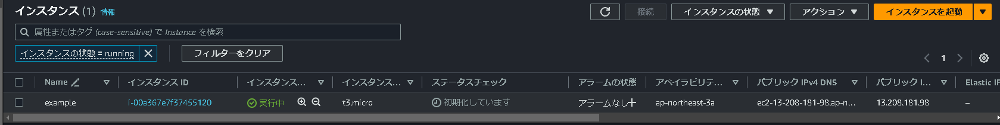
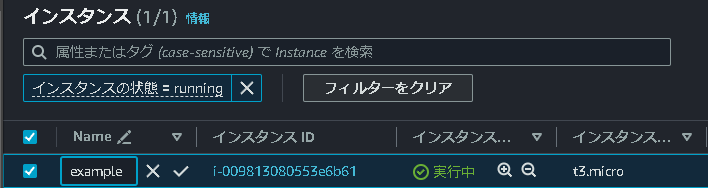
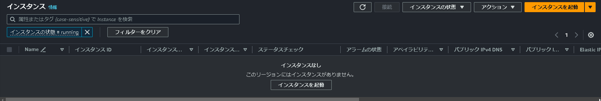

# 第2章　基本操作

## 2.1 リソースの作成
事前準備として、まずは適当なディレクトリに「main.tf」というファイルを作成する。
```
$ mkdir example
cd example
touch main.tf
```

### 2.1.1 HCL(HashiCorp Configuration Language)
作成したmain.tfをエディタ(VSCode等)で開き、リスト2.1のように実装する。<br />
このコードではAmazon Linux 2のAMIをベースに、EC2インスタンスを作成する。
- リスト2.1:EC2インスタンスの定義
```
resource "aws_instance" "example" {
  ami = "ami-014886dca6bd4bce2"
  instance_type = "t3.micro"
}
```
Terraformのコードは ***HCL(HashiCorp Configuration Language)*** という言語で実装する。<br />
HCLはTerraformを開発している、HashiCorp社が設計した言語である。<br />
EC2インスタンスのようなリソースは「***resource***」ブロックで定義する。

### 2.1.2 terraform init
コードを記載したら、作業ディレクトリ(main.tfファイル上に存在するコマンドライン上のディレクトリ内で)「***terraform init***」コマンドを実行し、リソース作成に必要なバイナリファイルをダウンロードする。<br />
「***Terraform has been successfully initialized!***」と表示されていれば、成功である。

```
$ terraform init
Initializing the backend...

Terraform has been successfully initialized!
```

### 2.1.3 terraform plan
次は「***terraform plan***」コマンドで、このコマンドを実行すると「***実行計画***」が出力され、<br />
これから何が起きるのかをTerraformが教えてくれる。<br />
要は、次のterraform apply前にリソースのデプロイ計画をコマンドライン上で出力してくれる。
```
Terraform used the selected providers to generate the following execution plan. Resource actions are indicated with the following symbols:
  + create

Terraform will perform the following actions:

  # aws_instance.example will be created
  + resource "aws_instance" "example" {
      + ami                                  = "ami-014886dca6bd4bce2"
      + arn                                  = (known after apply)
      + associate_public_ip_address          = (known after apply)
      + availability_zone                    = (known after apply)
      + cpu_core_count                       = (known after apply)
      + cpu_threads_per_core                 = (known after apply)
      + disable_api_stop                     = (known after apply)
      + disable_api_termination              = (known after apply)
      + ebs_optimized                        = (known after apply)
      + get_password_data                    = false
      + host_id                              = (known after apply)
      + host_resource_group_arn              = (known after apply)
      + iam_instance_profile                 = (known after apply)
      + id                                   = (known after apply)
      + instance_initiated_shutdown_behavior = (known after apply)
      + instance_lifecycle                   = (known after apply)
      + instance_state                       = (known after apply)
      + instance_type                        = "t3.micro"
      ......
    }

Plan: 1 to add, 0 to change, 0 to destroy.
```
「+」マークと共に「aws_instance.example will be created」というメッセージが出力されている。<br />
これは、「***新規にリソース(インフラのサービス)を作成する***」という意味である。

### 2.1.4 terraform apply

今度は「***terraform apply***」コマンドを実行する。<br />
このコマンドは、あらためてplan結果が表示され、本当に実行していいか確認が行われる。
```
$ terraform apply
Do you want to perform these actions?
  Terraform will perform the actions described above.
  Only 'yes' will be accepted to approve.

  Enter a value:
```

「Enter a value:」と表示され「***yes***」と入力すると、リソース作成を実行する。
```
aws_instance.example: Creating...
aws_instance.example: Still creating... [10s elapsed]
aws_instance.example: Creation complete after 12s [id=i-00a367e7f37455120]

Apply complete! Resources: 1 added, 0 changed, 0 destroyed.
```


また、「Enter a value:」の「***yes***」を省略したい場合は、コマンドの末尾に、`-auto-approve`を付け加えると、確認コマンドの省略が可能
```
$ terraform apply --auto-approve
aws_instance.example: Creating...
aws_instance.example: Still creating... [10s elapsed]
aws_instance.example: Creation complete after 12s [id=i-0e0d1531679fe992b]

Apply complete! Resources: 1 added, 0 changed, 0 destroyed.
```

## リソースの更新
リソースの作成に成功したら、設定値を変更してみる。

### 2.2.1 リソースの設定変更
リスト2.1をリスト2.2のように変更し、タグを追加する。
- リスト2.2:タグを追加
```
resource "aws_instance" "example" {
  ami = "ami-014886dca6bd4bce2"
  instance_type = "t3.micro"

  tags = {
    "Name" = "example"
  }
}
```

コードを修正したら、terraform applyを実行する。
```
$ terraform apply
# aws_instance.example will be updated in-place
  ~ resource "aws_instance" "example" {
        id                                   = "i-009813080553e6b61"
      ~ tags                                 = {
          + "Name" = "example"
        }
      ~ tags_all                             = {
          + "Name" = "example"
        }
        # (31 unchanged attributes hidden)

        # (8 unchanged blocks hidden)
    }

Plan: 0 to add, 1 to change, 0 to destroy.

Do you want to perform these actions?
  Terraform will perform the actions described above.
  Only 'yes' will be accepted to approve.

  Enter a value: yes
```

「+」マークから「~」マークに変化して「aws_instance.example will be updated in-place」というメッセージが出力されている。<br />
これは「既存のリソースの設定を変更する」という意味である。では、変更を反映する。

```
aws_instance.example: Modifying... [id=i-009813080553e6b61]
aws_instance.example: Modifications complete after 0s [id=i-009813080553e6b61]

Apply complete! Resources: 0 added, 1 changed, 0 destroyed.
```

AWSマネジメントコンソールでも、Nameタグの追加が確認できる。



### 2.2.2 リソースの再作成
Apacheをインストールするため、リスト2.3のように変更してapplyする。
- リスト2.3:User DataでApacheをインストール
```
  resource "aws_instance" "example" {
  ami = "ami-014886dca6bd4bce2"
  instance_type = "t3.micro"

  user_data = <<EOF
  #!/bin/bash
  yum install -y httpd
  systemctl start httpd.service
EOF
}
```

```
$ terraform apply
aws_instance.example: Refreshing state... [id=i-0e6407b47c18afd63]

Terraform used the selected providers to generate the following execution plan. Resource actions are indicated with the following symbols:
  ~ update in-place

Terraform will perform the following actions:

  # aws_instance.example will be updated in-place
  ~ resource "aws_instance" "example" {
        id                                   = "i-0e6407b47c18afd63"
      ~ tags                                 = {
          - "Name" = "example" -> null
        }
      ~ tags_all                             = {
          - "Name" = "example"
        } -> (known after apply)
      + user_data                            = "257587a8d788c37c7e4a0904d89684c521161c81"
        # (30 unchanged attributes hidden)

        # (8 unchanged blocks hidden)
    }

Plan: 0 to add, 1 to change, 0 to destroy.

Do you want to perform these actions?
  Terraform will perform the actions described above.
  Only 'yes' will be accepted to approve.

  Enter a value: yes
```

今度は「-/+」マークが付く。<br />
これは、「既存のリソースを削除して、新たなリソースを作成する」という意味である。
この場合は要注意である。これはリソース削除を伴うため、場合によってはサービスダウンを引き起こす。<br />
そのため、リソースが再作成される場合は念入りに確認すべきである。

```
aws_instance.example: Modifying... [id=i-0e6407b47c18afd63]
aws_instance.example: Still modifying... [id=i-0e6407b47c18afd63, 10s elapsed]
aws_instance.example: Still modifying... [id=i-0e6407b47c18afd63, 20s elapsed]
aws_instance.example: Still modifying... [id=i-0e6407b47c18afd63, 30s elapsed]
aws_instance.example: Still modifying... [id=i-0e6407b47c18afd63, 40s elapsed]
aws_instance.example: Still modifying... [id=i-0e6407b47c18afd63, 50s elapsed]
aws_instance.example: Still modifying... [id=i-0e6407b47c18afd63, 1m0s elapsed]
aws_instance.example: Still modifying... [id=i-0e6407b47c18afd63, 1m10s elapsed]
aws_instance.example: Still modifying... [id=i-0e6407b47c18afd63, 1m20s elapsed]
aws_instance.example: Modifications complete after 1m22s [id=i-0e6407b47c18afd63]

Apply complete! Resources: 0 added, 1 changed, 0 destroyed.
```

このように、Terraformによるリソースの更新は、「既存リソースをそのまま変更する」ケースと「リソースが作り直しになる」ケースがある。<br />
本番運用では、意図した挙動になるか、plan結果をきちんと確認することが大切である。

## 2.3 tfstateファイル
ここまでは、Terraformは、必要な部分だけを適切に変更した。しかし、その判断は「***tfstateファイル***」が行っている。<br />
applyを一度でも実行していれば、terraform.tfstateファイルが作成される。<br />
ファイルの中身を確認してみる。
```
$ cat terraform.tfstate
{
  "version": 4,
  "terraform_version": "1.6.4",
  "serial": 49,
  "lineage": "094700aa-c631-f246-1c76-a6085387ab43",
  "outputs": {},
  "resources": [
    {
      "mode": "managed",
      "type": "aws_instance",
      "name": "example",
      "provider": "provider[\"registry.terraform.io/hashicorp/aws\"]",
      "instances": [
        {
          "schema_version": 1,
          "attributes": {
            "ami": "ami-014886dca6bd4bce2",
            "arn": "arn:aws:ec2:ap-northeast-3:730054542356:instance/i-0e6407b47c18afd63",
            "associate_public_ip_address": true,
            "availability_zone": "ap-northeast-3a",
            "capacity_reservation_specification": [
              {
                "capacity_reservation_preference": "open",
                "capacity_reservation_target": []
              }
            ],
            .....
```
tfstateファイルは、Terraformが生成するファイルで、現在の状態を記録する。<br />
Terraformはtfstateファイルの状態とHCLのコードに差分があれば、その差分のみを変更するようにする。<br />
デフォルトではローカルでtfstateファイルを管理するが、リモートのストレージでも管理が可能。
詳細はchapter20の「tfstateファイルの管理」で学ぶ

## 2.4 リソースの削除
せっかく作ったリソースであるが、「***terraform destroy***」コマンドで削除する
```
$ terraform destroy
aws_instance.example: Refreshing state... [id=i-0e6407b47c18afd63]

Terraform used the selected providers to generate the following execution plan. Resource actions are indicated with the following symbols:
  - destroy

Terraform will perform the following actions:

  # aws_instance.example will be destroyed
  - resource "aws_instance" "example" {
      - ami                                  = "ami-014886dca6bd4bce2" -> null
      - arn                                  = "arn:aws:ec2:ap-northeast-3:730054542356:instance/i-0e6407b47c18afd63" -> null
      - associate_public_ip_address          = true -> null
      - availability_zone                    = "ap-northeast-3a" -> null
      - cpu_core_count                       = 1 -> null
      - cpu_threads_per_core                 = 2 -> null
      - disable_api_stop                     = false -> null
      - disable_api_termination              = false -> null
      - ebs_optimized                        = false -> null
      - get_password_data                    = false -> null
      - hibernation                          = false -> null
      - id                                   = "i-0e6407b47c18afd63" -> null
      - instance_initiated_shutdown_behavior = "stop" -> null
      - instance_state                       = "running" -> null
      - instance_type                        = "t3.micro" -> null
      - ipv6_address_count                   = 0 -> null
      - ipv6_addresses                       = [] -> null
      - monitoring                           = false -> null
      - placement_partition_number           = 0 -> null
      - primary_network_interface_id         = "eni-00e80b861035522ad" -> null
      - private_dns                          = "ip-172-31-44-102.ap-northeast-3.compute.internal" -> null
      - private_ip                           = "172.31.44.102" -> null
      - public_dns                           = "ec2-15-152-40-77.ap-northeast-3.compute.amazonaws.com" -> null
      - public_ip                            = "15.152.40.77" -> null
      - secondary_private_ips                = [] -> null
      - security_groups                      = [
          - "default",
        ] -> null
      - source_dest_check                    = true -> null
      - subnet_id                            = "subnet-0323a7c19d67ceeed" -> null
      - tags                                 = {} -> null
      - tags_all                             = {} -> null
      - tenancy                              = "default" -> null
      - user_data                            = "257587a8d788c37c7e4a0904d89684c521161c81" -> null
      - user_data_replace_on_change          = false -> null
      - vpc_security_group_ids               = [
          - "sg-018873c2e0e10924c",
        ] -> null

      - capacity_reservation_specification {
          - capacity_reservation_preference = "open" -> null
        }

      - cpu_options {
          - core_count       = 1 -> null
          - threads_per_core = 2 -> null
        }

      - credit_specification {
          - cpu_credits = "unlimited" -> null
        }

      - enclave_options {
          - enabled = false -> null
        }

      - maintenance_options {
          - auto_recovery = "default" -> null
        }

      - metadata_options {
          - http_endpoint               = "enabled" -> null
          - http_protocol_ipv6          = "disabled" -> null
          - http_put_response_hop_limit = 1 -> null
          - http_tokens                 = "optional" -> null
          - instance_metadata_tags      = "disabled" -> null
        }

      - private_dns_name_options {
          - enable_resource_name_dns_a_record    = false -> null
          - enable_resource_name_dns_aaaa_record = false -> null
          - hostname_type                        = "ip-name" -> null
        }

      - root_block_device {
          - delete_on_termination = true -> null
          - device_name           = "/dev/sda1" -> null
          - encrypted             = false -> null
          - iops                  = 100 -> null
          - tags                  = {} -> null
          - throughput            = 0 -> null
          - volume_id             = "vol-02ac0aabf7b96e076" -> null
          - volume_size           = 10 -> null
          - volume_type           = "gp2" -> null
        }
    }

Plan: 0 to add, 0 to change, 1 to destroy.

Do you really want to destroy all resources?
  Terraform will destroy all your managed infrastructure, as shown above.
  There is no undo. Only 'yes' will be accepted to confirm.

  Enter a value: yes
```

ここでは、「-」マークが付き「***aws_instance.example will be destroyed***」というメッセージが出力される。<br />
これは「***リソースを削除する***」という意味である。applyコマンドと同様に、実行していいか確認が行われるので、yesと入力して削除を実行する。<br />
terraform destroyも末尾に`-auto-approve`を追記すると、確認コマンドの省略が可能

```
aws_instance.example: Destroying... [id=i-0e6407b47c18afd63]
aws_instance.example: Still destroying... [id=i-0e6407b47c18afd63, 10s elapsed]
aws_instance.example: Still destroying... [id=i-0e6407b47c18afd63, 20s elapsed]
aws_instance.example: Still destroying... [id=i-0e6407b47c18afd63, 30s elapsed]
aws_instance.example: Still destroying... [id=i-0e6407b47c18afd63, 40s elapsed]
aws_instance.example: Still destroying... [id=i-0e6407b47c18afd63, 50s elapsed]
aws_instance.example: Still destroying... [id=i-0e6407b47c18afd63, 1m0s elapsed]
aws_instance.example: Still destroying... [id=i-0e6407b47c18afd63, 1m10s elapsed]
aws_instance.example: Destruction complete after 1m10s

Destroy complete! Resources: 1 destroyed.
```

AWSマネジメントコンソールを確認すると、インスタンスが削除されている。

