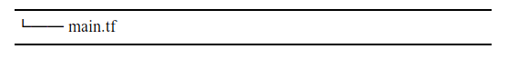

# 第4章　全体設計
いよいよここから本格的なTerraformの実装に入る。まず本章では、第5章から16章にかけて構築するシステムの全体像を説明する。

## 4.1 システム要件
Docker化したアプリケーションでWebサービスを提供することが、本書で構築するシステムの目的である。 
なお、アプリケーションの種類は特に限定していない。 
非機能要件について厳密な定義はしないが、可用性やスケーラビリティ、セキュリティなどは可能な範囲で考慮する。また運用を楽にするため、マネージドサービスを積極的に採用する。

## 4.2 アーキテクチャ設計
エンドユーザーはHTTPSでWebサービスにアクセスする。ロードバランサーをパブリックネットワークに配置し、アプリケーションを動かすコンテナオーケストレーションサービスや、データベースはプライベートネットワークに配置する。 
バッチのジョブ管理や暗号化のための鍵管理、アプリケーションの設定管理はすべてマネージドサービスで実装し、運用負荷の低減を図る。また、デプロイメントパイプラインを構築して、継続的デリバリー(CD)を実現する。 
あわせて、運用で困らないようにオペレーションサーバーを構築し、ログの検索と永続化の仕組みを整える。

## 4.3 テクノロジースタック
次のようなリソースを、各章で実装していく(図4.1)
- 第5章「権限管理」: IAMポリシー、IAMロール
- 第6章「ストレージ」: S3
- 第7章「ネットワーク」: VPC、NATゲートウェイ、セキュリティグループ
- 第8章「ロードバランサーとDNS」: ALB、Route53、ACM
- 第9章「コンテナオーケストレーション」: ECS Fargate
- 第10章「バッチ」: ECS Scheduled Tasks
- 第11章「鍵管理」: KMS
- 第12章「設定管理」: SSMパラメータストア
- 第13章「データストア」: RDS、ElastiCache
- 第14章「デプロイメントパイプライン」: ECR、CodeBuild、CodePipeline
- 第15章「SSHレスオペレーション」: EC2、Session Manager
- 第16章「ロギング」: CloudWatch Logs、Kinesis Data Firehose

図4.1 テクノロジースタック 

## ファイルレイアウト
第5章から第16章で登場するサンプルコードは、基本的に同一ディレクトリ内での実装を前提とする。 
例えば、すべてを単一ファイルで実装できる。

あるいは、次のように複数ファイルへ分割することもできる。 
Terraformは拡張子「***tf***」のファイルを自動的に読み込むため、単一ファイルと同様に動作する。

例外はモジュールで「5.2.4 IAMロールのモジュール化」や「7.4.2 セキュリティグループのモジュール化」では、サブディレクトリ配下にコードを実装する。

