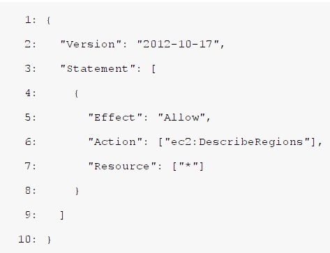

# 第5章　権限管理
AWSでは、あるサービスから別のサービスを操作する際に、権限が必要である。<br />
そこで本章では、AWSのサービスに対する権限付与の方法を学習する。

## 5.1 ポリシー
権限はポリシーで定義する。ポリシーでは「実行可能なアクション」や「操作可能なリソース」を指定でき、柔軟に権限が設定できる。

### 5.1.1 ポリシードキュメント
ポリシーは「ポリシードキュメント」という、リスト5.1のようなJSONで記述する。

リスト5.1: JSON形式のポリシードキュメント


ポリシードキュメントでは、次のような要素を記述する。
- **Effect**: Allow(許可)またはDeny(拒否)
- **Action**: 何のサービスで、どんな操作が実行できるか
- **Resource**: 操作可能なリソースは何か
リスト5.1は、「リージョン一覧を取得する」という権限を意味する。なお、7行目の「*」は扱いが特殊で「すべて」という意味になる。
リスト5.2のように**aws_iam_policy_document**データソースでもポリシーを記述可能である。<br />
コメントの追加や変数の参照ができて便利である。

リスト5.2: ポリシードキュメントの定義
```
data "aws_iam_policy_document" "allow_describe_regions" {
    statement {
      effect = "Allow"
      actions = ["ec2:DescribeRegions"] # リージョン一覧を取得する
      resources = ["*"]
    }
}
```

### 5.1.2 IAMポリシー
ポリシードキュメントを保持するリソースが「IAMポリシー」である。<br />
リスト5.3のように、ポリシー名とポリシードキュメントを設定する。

リスト5.3: IAMポリシーの定義
```
resource "aws_iam_policy" "example" {
  name = "example"
  policy = data.aws_iam_policy_document.allow_describe_regions.json
}
```

## 5.2 ロール
AWSのサービスへ権限を付与するために、「IAMロール」を作成する。

### 5.2.1 信頼ポリシー
