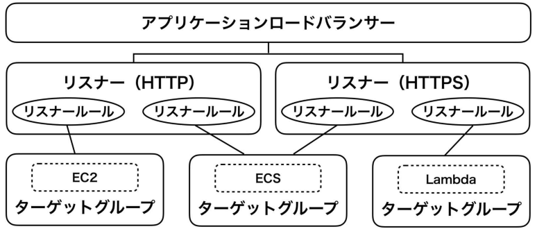

# 第8章 ロードバランサーとDNS
本章では**ALB(Application Load Balancer)**を学ぶ。あわせて**Route 53**と**ACM(AWS Certificate Manager)**を使い、HTTPSでアクセスできるよう設定する。

## 8.1 ALBの構成要素
ALBはAWSが提供するロードバランサーである。ALBはクロスゾーン負荷分散に標準で対応しており、複数のアベイラビリティゾーンのバックエンドサーバーに、リクエストを振り分けられる。HTTPSの終端やECS Fargateとの連携もサポートされている。ALBは図8.1のように、複数のリソースで構成される。

図8.1: ALBの構成要素


リスナーに定義したポートでリクエストを受け付け、パスなどの一定のルールに基づき、ロードバランサーの背後にいるターゲットへリクエストを転送する。本章では、最終的に、ALBで受け取ったリクエストは、第9章で学ぶECSへ振り分ける。

## 8.2 HTTP用ロードバランサー
まずはHTTPアクセス可能なALBを作成する。なお、ALBを配置するネットワークは第7章のものを使用する。以降の章でも、注記することなくこのリソースを使う。

### 8.2.1 アプリケーションロードバランサー
最初にアプリケーションロードバランサーを、リスト8.1のように定義する。

リスト8.1: アプリケーションロードバランサーの定義
```
# ロードバランサーapplyする場合は、最初にchapter7で学習したネットワークを構築する！！
module "vpc" {
    source = "./vpc"
}

# ログバケットの定義
resource "aws_s3_bucket" "alb_log" {
  bucket = "alb-log-pragmatic1-terraform"
}

resource "aws_s3_bucket_lifecycle_configuration" "example" {
  bucket = aws_s3_bucket.alb_log.id

  rule {
    id = "rule-1"
    status = "Enabled"

    expiration {
      days = 180
    }
  }
}

# バケットポリシーの定義
resource "aws_s3_bucket_policy" "alb_log" {
  bucket = aws_s3_bucket.alb_log.id
  policy = data.aws_iam_policy_document.alb_log.json
}

data "aws_iam_policy_document" "alb_log" {
  statement {
    effect = "Allow"
    actions = ["s3:PutObject"]
    resources = ["arn:aws:s3:::${aws_s3_bucket.alb_log.id}/*"]

    principals {
      type = "AWS"
      identifiers = ["582318560864"] # LBが管理しているAWS東京リージョンのアカウントIDを許可
    }
  }
}

resource "aws_lb" "example" {
    name = "example"
    load_balancer_type = "application"
    internal = false
    idle_timeout = 60
    enable_deletion_protection = false

    subnets = [
        module.vpc.aws_subnet_public_0_id,
        module.vpc.aws_subnet_public_1_id
    ]

    access_logs {
        bucket = aws_s3_bucket.alb_log.id
        enabled = true
    }

    security_groups = [
        module.http_sg.security_group_id,
        module.https_sg.security_group_id,
        module.http_redirect_sg.security_group_id
    ]
}

output "alb_dns_name" {
    value = aws_lb.example.dns_name
}
```

32、33行目のsubnetsを定義する際は、moduleから値を取得しているが、moduleから値を取得する際には、vpcを構築するリソースから**output**構文を取得し、値を呼びだすようにする！！<br />
これは、Terraformの仕様で外部moduleから値を取得する際に利用される。

#### 名前と種別
名前はnameで設定する。また、種別をload_balancer_typeで設定する。aws_lbリソースはALBだけでなく、<br />
***NBL(Network Load Balancer)***も作成できる。「application」を指定するとALB、「network」を指定するとNLBになる。

#### Internal
ALBが「インターネット向け」なのか「VPC内部向け」なのかを指定する。インターネット向けの場合は、internalをfalseにする。

#### タイムアウト
idle_timeoutは秒単位で指定する。タイムアウトのデフォルト値は60秒である。

#### 削除保護
enable_deletion_protectionをtrueにすると、削除保護が有効になる。本番環境では誤って削除しないよう、有効にしておく。

#### サブネット
ALBが所属するサブネットをsubnetsで指定する。異なるアベイラビリティゾーンのサブネットを指定して、クロスゾーン負荷分散を実現する。

#### アクセスログ
access_logsにバケット名を指定すると、アクセスログの保存が有効になる。ここでは、第6章のリスト6.4で作成したS3バケットを指定する。

#### セキュリティグループ
セキュリティグループをリスト8.2のように定義する。HTTPの80番ポートとHTTPSの443番ポートに加えて、「8.5.2 HTTPのリダイレクト」で使用する8080番ポートも許可する。そして、リスト8.1のsecurity_groupsに、これらのセキュリティグループを設定する。

リスト8.2: アプリケーションロードバランサーのセキュリティグループの定義
```
module "http_sg" {
    source = "./security_group"
    name = "http_sg"
    vpc_id = module.vpc.vpc_id
    port = 80
    cidr_blocks = ["0.0.0.0/0"]
}

module "https_sg" {
    source = "./security_group"
    name = "https_sg"
    vpc_id = module.vpc.vpc_id
    port = 443
    cidr_blocks = ["0.0.0.0/0"]
}

module "http_redirect_sg" {
    source = "./security_group"
    name = "http_redirect_sg"
    vpc_id = module.vpc.vpc_id
    port = 8080
    cidr_blocks = ["0.0.0.0/0"]
}
```
vpc_idも同様に、vpcを構築するリソースから**output**構文を取得し、値を呼びだすようにする！！

### 8.2.2 リスナー
リスナーで、どのポートのリクエストを受け付けるか設定する。リスナーはALBに複数アタッチ可能。リスナーはリスト8.3のように定義する。

リスト8.3: HTTPリスナーの定義
```
resource "aws_lb_listener" "http" {
    load_balancer_arn = aws_lb.example.arn
    port = "80"
    protocol = "HTTP"

    default_action {
      type = "fixed-response"

      fixed_response {
        content_type = "text/plain"
        message_body = "これは『HTTP』である。"
        status_code = "200"
      }
    }
}
```

#### ポート番号
portには1~65535の値が設定可能。ここではHTTPなので「80」を指定する。

#### プロトコル
ALBは「HTTP」と「HTTPS」のみサポートしており、protocolで指定する。

#### デフォルトアクション
リスナーは複数のルールを設定して、異なるアクションを実行可能である。もし、いずれのルールにも合致しない場合は、default_actionが実行される。定義できるアクションにはいくつかあるが、ここでは3つ紹介する。
- **forward** : リクエストを別ターゲットグループに転送
- **fixed-response** : 固定のHTTPレスポンスを応答
- **redirect** : 別のURLにリダイレクト

### 8.2.3 HTTPアクセス
リスト8.1からリスト8.3をapplyする。

```
$ terraform apply -auto-approve

Apply complete! Resources: 48 added, 0 changed, 0 destroyed.

Outputs:

alb_dns_name = "example-1081498324.ap-northeast-1.elb.amazonaws.com"
```

出力されたalb_dns_nameに、HTTPでアクセスする。

```
$ curl http://example-1081498324.ap-northeast-1.elb.amazonaws.com


StatusCode        : 200
StatusDescription : OK
Content           : これは『HTTP』である。
RawContent        : HTTP/1.1 200 OK
                    Connection: keep-alive
                    Content-Length: 31
                    Content-Type: text/plain; charset=utf-8
                    Date: Fri, 01 Dec 2023 19:43:50 GMT
                    Server: awselb/2.0

                    これは『HTTP』である。
Forms             : {}
Headers           : {[Connection, keep-alive], [Content-Length, 31], [Content-Type, text/plain; charset=utf-8], [Date, Fri, 01 Dec 2023 19:43:50 GMT]...}
Images            : {}
InputFields       : {}
Links             : {}
ParsedHtml        : System.__ComObject
RawContentLength  : 31
```

## 8.3 Route 53
Route 53は、AWSが提供する**DNS(Domain Name System)**のサービスである。

### 8.3.1 ドメインの登録
AWSマネジメントコンソールから次の手続きを行うと、ドメインの登録ができる。
1. ドメインの登録
2. 連絡先情報の入力
3. 登録メールアドレスの有効性検証

なお、ドメインの登録は、Terraformでは実行できない。

### 8.3.2 ホストゾーン
ホストゾーンはDNSレコードを束ねるリソースである。Route 53でドメインを登録した場合は、自動的に作成される。同時にNSレコードとSOAレコードも作成される。本章では、Route 53で「example.com」を登録した前提で説明する。

#### ホストゾーンの参照
自動作成されたホストゾーンは、リスト8.4のように参照する。

リスト8.4: ホストゾーンのデータソース定義
```
data "aws_route53_zone" "example" {
  name = "example.com"
}
```

#### ホストゾーンの作成
新規にホストゾーンを作成するには、リスト8.5のように定義する。

リスト8.5: ホストゾーンのリソース定義
```
resource "aws_route53_zone" "test_example" {
  name = "test.example.com"
}
```

### 8.3.3 DNSレコード
DNSレコードをリスト8.6のように定義する。これで、設定したドメインでALBへとアクセスできるようになる。

リスト8.6: ALBのDNSレコードの定義
```
resource "aws_route53_record" "example" {
  zone_id = data.aws_route53_zone.example.zone_id
  name = data.aws_route53_zone.example.name
  type = "A"

  alias {
    name = aws_lb.example.dns_name
    zone_id = aws_lb.example.zone_id
    evaluate_target_health = true
  }
}

output "domain_name" {
  value = aws_route53_record.example.name
}
```

#### DNSレコードタイプ
DNSレコードタイプはtypeに設定する。AレコードやCNAMEレコードなど、一般的なレコードタイプが指定可能である。AWS独自拡張のALIASレコードを使用する場合は、Aレコードを表す「A」を指定する。

#### ALIASレコード
ALIASレコードは、AWSでのみ使用可能なDNSレコードである。DNSから見ると、単なるAレコードという扱いになる。ALIASレコードは、AWSの各種サービスと統合されており、ALBだけでなくS3バケットやCloudFrontも指定できる。<br />
CNAMEレコードは、「ドメイン名→CNAMEレコードのドメイン名→IPアドレス」という流れで名前解決を行う。一方、ALIASレコードは、「ドメイン名→IPアドレス」という流れで名前解決が行われ、パフォーマンスが向上する。aliasにALBのDNS名とゾーンIDを指定すると、ALBのIPアドレスへ名前解決できるようになる。

### 8.3.4 独自ドメインへのアクセス
リスト8.1からリスト8.6をapplyする。
applyする前に、AWSマネジメントコンソールからRoute 53を利用して、ドメイン登録を行う必要がある！！<br />
しかし、ドメインと登録する場合は、コスト(料金)がかかるので、注意が必要。<br />
ドメインをすぐに削除しても、返金はされない。

```
$ terraform apply -auto-approve

Apply complete! Resources: 50 added, 0 changed, 0 destroyed.

Outputs:

alb_dns_name = "example-171455711.ap-northeast-1.elb.amazonaws.com"
domain_name = "sample0917.com"
```

出力されたdomain_nameに、HTTPでアクセスする。

```

$ curl http://sample0917.com


StatusCode        : 200
StatusDescription : OK
Content           : これは『HTTP』である。
RawContent        : HTTP/1.1 200 OK
                    Connection: keep-alive
                    Content-Length: 31
                    Content-Type: text/plain; charset=utf-8
                    Date: Sun, 03 Dec 2023 21:24:00 GMT
                    Server: awselb/2.0

                    これは『HTTP』である。
Forms             : {}
Headers           : {[Connection, keep-alive], [Content-Length, 31], [Content-Type, text/plain; charset=utf-8], [Date, Sun, 03 Dec 2023 21:24:00 GMT]...}
Images            : {}
InputFields       : {}
Links             : {}
ParsedHtml        : System.__ComObject
RawContentLength  : 31
```

「8.2.3 HTTPアクセス」と同様に表示されれば成功である。

## 8.4 ACM(AWS Certificate Manager)
次に、HTTPS化するために必要なSSL証明書を、**ACM(AWS Certificate Manager)**で作成する。ACMは煩雑なSSL証明書の管理を担ってくれるマネージドサービスで、ドメイン検証をサポートしている。SSL証明書の自動更新ができるため「証明書の更新を忘れた！！」という幾度となく人類が繰り返してきた悲劇から解放される。

### 8.4.1 SSL証明書の作成
SSL証明書は、リスト8.7のように定義する。

リスト8.7: SSL証明書の定義
```
resource "aws_acm_certificate" "example" {
  domain_name = aws_route53_record.example.name
  subject_alternative_names = []
  validation_method = "DNS"

  lifecycle {
    create_before_destroy = true
  }
}
```

#### ドメイン名
ドメイン名はdomain_nameで設定する。なお、「*.example.com」のように指定すると、ワイルドカード証明書を発行可能である。

#### ドメイン名の追加
ドメイン名を追加したい場合、subject_alternative_namesを設定する。例えば、「"test.example.com"」と指定すると、「example.com」と「test.example.com」のSSL証明書を作成する。追加しない場合は、空リストを作成する。

#### 検証方法
ドメインの所有権の検証方法を、validation_methodで設定する。DNS検証かEメール検証を選択可能。SSL証明書を自動更新したい場合、DNS検証を選択する。

#### ライフサイクル
lifecycle定義で「新しいSSL証明書を作ってから、古いSSL証明書と差し替える」という挙動に変更し、SSL証明書の再作成時のサービス影響を最小化する。<br />
ライフサイクルはTerraform独自の機能で、すべてのリソースに設定可能である。通常のリソースの再作成は、「リソースを削除してから、リソースを削除する」という挙動になる。しかし、create_before_destroyをtrueにすると、「リソースを作成してから、リソースを削除する」という逆の挙動に変更可能である。

### 8.4.2 SSL証明書の検証
DNSによる、SSL証明書の検証もTerraformで実装可能である。

#### 検証用のDNSレコード
DNS検証用のDNSレコードを追加する。リスト8.8のように、設定する値の大半はaws_acm_certificateリソースから参照する。なお、リスト8.7でsubject_alternative_namesにドメインを追加した場合、そのドメイン用のDNSレコードも必要になるので注意が必要である。

SSL証明書の検証用レコードの追加する場合は、以下のドキュメントを参考に作成するとよい。
https://registry.terraform.io/providers/hashicorp/aws/latest/docs/resources/acm_certificate#referencing-domain_validation_options-with-for_each-based-resources

リスト8.8: SSL証明書の検証用レコードの定義
```
resource "aws_route53_record" "example_certificate" {
  for_each = {
    for dvo in aws_acm_certificate.example.domain_validation_options : dvo.domain_name => {
      name = dvo.resource_record_name
      record = dvo.resource_record_value
      type = dvo.resource_record_type
    }
  }
  name = each.value.name
  type = each.value.type
  records = [each.value.record]
  zone_id = data.aws_route53_zone.example.id
  ttl = 60
}
```

#### 検証の待機
aws_acm_certificate.validationリソースは特殊で、リスト8.9のように定義すると、apply時にSSL証明書の検証が完了するまで待機する。実際になにかのリソースを作るわけではない。

以下のドキュメントを参考にリソースを作成するとよい。
https://registry.terraform.io/providers/hashicorp/aws/latest/docs/resources/acm_certificate_validation#dns-validation-with-route-53

リスト8.9: SSL証明書の検証完了までの待機
```
resource "aws_acm_certificate_validation" "example" {
  certificate_arn = aws_acm_certificate.example.arn
  validation_record_fqdns = [for record in aws_route53_record.example_certificate : record.fqdn]
}
```

## 8.5 HTTPS用ロードバランサー
SSL証明書を発行したので、HTTPSでALBにアクセスできるようHTTPSリスナーを作成する。

### 8.5.1 HTTPSリスナー
HTTPSリスナーは、リスト8.10のように定義する。

リスト8.10: HTTPSリスナーの定義
```
resource "aws_lb_listener" "https" {
  load_balancer_arn = aws_lb.example.arn
  port = "443"
  protocol = "HTTPS"
  certificate_arn = aws_acm_certificate.example.arn
  ssl_policy = "ELBSecurityPolicy-2016-08"

  default_action {
    type = "fixed-response"

    fixed_response {
      content_type = "text/plain"
      message_body = "これは『HTTPS』である。"
      status_code = "200"
    }
  }
}
```

#### ポート番号とプロトコル
portとprotocolに、それぞれ「443」と「HTTPS」を指定する。

#### SSL証明書
リスト8.7で作成したSSL証明書を、certificate_arnに指定する。

#### セキュリティポリシー
ssl_policyに「ELBSecurityPolicy-2016-08」を指定する。AWSでは、このセキュリティポリシーの利用が推奨されている。

### 8.5.2 HTTPのリダイレクト
HTTPをHTTPSへリダイレクトするために、リダイレクトリスナーを作成する。リスト8.11のように、default_actionでredirectの設定をするだけである。

リスト8.11: HTTPSからHTTPSにリダイレクトするリスナーの定義
```
resource "aws_lb_listener" "redirect_http_to_https" {
  load_balancer_arn = aws_lb.example.arn
  port = "8080"
  protocol = "HTTP"

  default_action {
    type = "redirect"

    redirect {
      port = "443"
      protocol = "HTTPS"
      status_code = "HTTP_301"
    }
  }
}
```

### 8.5.3 HTTPSアクセス
リスト8.1からリスト8.11をapplyして、HTTPSでアクセスする。リスト8.10の13行目で定義した文字列が表示されれば成功である。
```
$ curl https://sample0917.com


StatusCode        : 200
StatusDescription : OK
Content           : これは『HTTPS』である。
RawContent        : HTTP/1.1 200 OK
                    Connection: keep-alive
                    Content-Length: 32
                    Content-Type: text/plain; charset=utf-8
                    Date: Mon, 04 Dec 2023 18:10:09 GMT
                    Server: awselb/2.0

                    これは『HTTPS』である。
Forms             : {}
Headers           : {[Connection, keep-alive], [Content-Length, 32], [Content-Type, text/plain; charset=utf-8], [Date, Mon, 04 Dec 2023 18:10:09 GMT]...}
Images            : {}
InputFields       : {}
Links             : {}
ParsedHtml        : System.__ComObject
RawContentLength  : 32
```

次に、HTTPからHTTPSへのリダイレクトを確認する。ポート番号はリスト8.11で設定した8080番である。オプションなしでcurlを実行すると、301で返ってくる。
```
$ curl http://sample0917.com:8080
<html>
<head><title>301 Moved Permanently</title></head>
<body>
<center><h1>301 Moved Permanently</h1></center>
</body>
</html>
```

今度はcurlに-Lオプションをつけて実行する。
```
$ curl -L http://sample0917.com:8080

これは『HTTPS』である。
```

すると、正しくHTTPSへリダイレクトしていることを確認できる。

## 8.6 リクエストフォワーディング
最後に任意のターゲットへ、リクエストをフォワードできるようにする。

### 8.6.1 ターゲットグループ
ALBがリクエストをフォワードする対象を「ターゲットグループ」と呼び、リスト8.12のように定義する。このターゲットグループは、第9章のECSサービスと関連付ける。

リスト8.12: ターゲットグループの定義
```
resource "aws_lb_target_group" "example" {
  name = "example"
  target_type = "ip"
  vpc_id = module.vpc.vpc_id
  port = 80
  protocol = "HTTP"
  deregistration_delay = 300

  health_check {
    path = "/"
    healthy_threshold = 5
    unhealthy_threshold = 2
    timeout = 5
    interval = 30
    matcher = 200
    port = "traffic-port"
    protocol = "HTTP"
  }

  depends_on = [aws_lb.example]
}
```

#### ターゲットタイプ
ターゲットの種類をtarget_typで設定する。EC2インスタンスやIPアドレス、Lambda関数などが指定できる。ECS Fargateでは「ip」を指定する。

#### ルーティング先
ターゲットグループにipを指定した場合はさらに、vpc_id・port・protocolを設定する。多くの場合は、HTTPSの終端はALBで行うため、protocolには「HTTP」を指定することが多い。

#### 登録解除の待機時間
ターゲットの登録を解除する前に、ALBが待機する時間をderegistration_delayで設定する。秒単位で指定し、デフォルト値は300秒である。

#### ヘルスチェック
health_checkで設定する項目は、次のとおりである。
- **path** : ヘルスチェックで使用するパス
- **healthy_threshold** : 正常判定を行うまでのヘルスチェック実行回数
- **unhealthy_threshold** : 異常判定を行うまでのヘルスチェック実行回数
- **timeout** : ヘルスチェックのタイムアウト時間(秒)
- **interval** : ヘルスチェックの実行間隔(秒)
- **matcher** : 正常判定を行うために使用するHTTPステータスコード
- **port** : ヘルスチェックで使用するポート
- **protocol** : ヘルスチェック時に使用するプロトコル

なお、health_checkのportを16行目のように「traffic-port」と指定した場合、5行目で指定したポート番号が使われる。

#### 暗黙的な依存関係
リスト8.1のアプリケーションロードバランサーとターゲットグループを、第9章で登場するECSサービスと同時に作成するとエラーになる。そこで、20行目のdepends_onで依存関係を制御するワークアラウンドを追加し、エラーを回避する。

### 8.6.2 リスナールール
ターゲットグループにリクエストをフォワードするリスナールールを作成する。リスナールールはリスト8.13のように定義する。

リスト8.13: リスナールールの定義
```
resource "aws_lb_listener_rule" "example" {
  listener_arn = aws_lb_listener.https.arn
  priority = 100

  action {
    type = "forward"
    target_group_arn = aws_lb_target_group.example.arn
  }

  condition {
    path_pattern {
      values = ["/*"]
    }
  }
}
```

#### 優先順位
リスナールールは複数定義でき、優先順位をpriorityで設定する。数字が小さいほど、優先順位が高い。なお、デフォルトルートはもっとも優先順位が低い。

#### アクション
actionで、フォワード先のターゲットグループを設定する。

#### 条件
conditionには、「/img/*」のようなパスベースや「example.com」のようなホストベースなどで、条件を指定できる。「/*」は全てのパスでマッチする。

#### ALBの削除
リスト8.1で作成したALBを削除する場合、destroyコマンドを実行する前に、削除保護を無効にする。そのためには、enable_deletion_protectionをfalseにして一度applyする。するとALBが削除できるようになる。