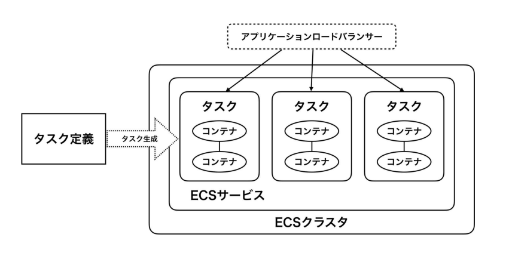

# 第9章 コンテナオーケストレーション
本章ではコンテナオーケストレーションサービスの **ECS(Elastic Container Service)** について学ぶ。AWSでは **EKS(Elastic Kubernetes Service)** も有名であるが、ECSはシンプルで敷居が低いため、本書ではECSを採用する。

## 9.1 ECSの構成要素
ECSは複数のコンポーネントを組み合わせて実装する(図9.1)。ホストサーバーを束ねる「ECSクラスタ」、コンテナの実行単位となる「タスク」、タスクを長期稼働させてALBとのつなぎ役にもなる「ECSサービス」などある。

図9.1: ECSの構成要素

## 9.2 ECSの起動タイプ