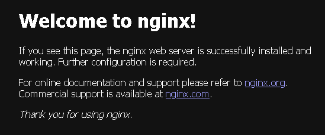

# 第9章 コンテナオーケストレーション
本章ではコンテナオーケストレーションサービスの **ECS(Elastic Container Service)** について学ぶ。AWSでは **EKS(Elastic Kubernetes Service)** も有名であるが、ECSはシンプルで敷居が低いため、本章ではECSを採用する。

## 9.1 ECSの構成要素
ECSは複数のコンポーネントを組み合わせて実装する(図9.1)。ホストサーバーを束ねる「ECSクラスタ」、コンテナの実行単位となる「タスク」、タスクを長期稼働させてALBとのつなぎ役にもなる「ECSサービス」などある。

図9.1: ECSの構成要素


## 9.2 ECSの起動タイプ
ECSには「EC2起動タイプ」と「Fargate起動タイプ」が存在する。

### 9.2.1 EC2起動タイプ
EC2起動タイプでは、ホストサーバーへSSHログインしてデバッグしたり、SpotFleetを併用してコスト削減を図ることが可能である。その半面、ホストサーバーの管理が必要なため、運用はやや煩雑である。

### 9.2.2 Fargate起動タイプ
Fargate起動タイプは、ホストサーバーの管理が不要で運用は楽である。その反面、SSHログインはできないため、デバッグの難易度は上がる。本章では、運用が楽なFargate起動タイプで実装する。

## 9.3 Webサーバーの構築
ここでは、ECSをプライベートネットワークに配置し、nginxコンテナを起動する。ALB経由でリクエストを受け取り、それをECS上のnginxコンテナが処理する。

### 9.3.1 ECSクラスタ
ECSクラスタは、Dockerコンテナを実行するホストサーバーを、論理的に束ねるリソースである。リスト9.1のように、クラスタ名を指定するだけである。

リスト9.1: ECSクラスタの定義
```
resource "aws_ecs_cluster" "example" {
  name = "example"
}
```

### 9.3.2 タスク定義
コンテナの実行単位を「**タスク**」と呼ぶ。例えば、Railsアプリケーションの前段にnginxを配置する場合、ひとつのタスクの中でRailsコンテナとnginxコンテナが実行される。<br />
そして、タスクは「**タスク定義**」から生成される。タスク定義では、コンテナ実行時に設定を記述する。オブジェクト指向言語で例えると、タスク定義はクラスで、タスクはインスタンスである。タスク定義はリスト9.2のように実装する。

リスト9.2: タスク定義
```
resource "aws_ecs_task_definition" "example" {
  family = "example"
  cpu = "256"
  memory = "512"
  network_mode = "awsvpc"
  requires_compatibilities = ["FARGATE"]
  container_definitions = file("./container_definitions.json")
}
```

#### ファミリー
ファミリーとはタスク定義名のプレフィックスで、familyに設定する。ファミリーにリビジョン番号を付与したものがタスク定義名になる。リスト9.2の場合、最初は「**example:1**」である。リビジョン番号は、タスク定義更新時にインクリメントされる。

#### タスクサイズ
cpuとmemoryで、タスクが使用するリソースのサイズを設定する。cpuはCPUユニットの整数表現(例:1024)か、vCPUの文字列表現(例:1vCPU)で設定する。memoryはMiBの整数表現(例:1024)か、GBの文字列表現(例:1GB)で設定する。<br />
なお、設定できる値の組み合わせは決まっている。例えばcpuに256を指定する場合、memoryで指定できる値は512・1024・2048のいずれかである。

#### ネットワークモード
Fargate起動タイプの場合は、network_modeに「awsvpc」を指定する。

#### 起動タイプ
requires_compatibilitiesに「Fargate」を指定する。

#### コンテナ定義
「container_definitions.json」ファイルにタスクで実行するコンテナを定義する。これはコンテナ定義と呼ばれ、リスト9.3のように実装する。

リスト9.3: コンテナ定義
```
[
    {
        "name": "example",
        "image": "nginx/latest",
        "essential": true,
        "portMappings": [
            {
                "protocol": "tcp",
                "containerPort": 80
            }
        ]
    }
]
```

パラメータの意味は次のとおりである。ほかにも多様なパラメータが設定可能である。
- **name** : コンテナの名前
- **image** : 使用するコンテナイメージ
- **essential** : タスク実行に必須かどうかのフラグ
- **portMappings** : マッピングするコンテナのポート番号

### 9.3.3 ECSサービス
通常、コンテナを起動しても、処理が完了したらすぐに終了する。もちろん、Webサービスでそれは困るため、「**ECSサービス**」を使う。<br />
ECSサービスはリスト9.4のように実装する。ECSサービスは起動するタスクの数を定義でき、指定した数のタスクを維持する。なんらかの理由でタスクが終了してしまった場合、自動的に新しいタスクを起動してくれる優れものである。<br />
また、ECSサービスはALBとの橋渡し役にもなる。インターネットからのリクエストはALBで受け、そのリクエストをコンテナにフォワードする。

リスト9.4: ECSサービスの定義
```
module "loadbalancer" {
    source = "./loadbalancer"
}

# ECSクラスタの定義
resource "aws_ecs_cluster" "example" {
  name = "example"
}

# タスク定義
resource "aws_ecs_task_definition" "example" {
  family = "example"
  cpu = "256"
  memory = "512"
  network_mode = "awsvpc"
  requires_compatibilities = ["FARGATE"]
  container_definitions = file("./container_definitions.json")
}

resource "aws_ecs_service" "example" {
  name = "example"
  cluster = aws_ecs_cluster.example.arn
  task_definition = aws_ecs_task_definition.example.arn
  desired_count = 2
  launch_type = "FARGATE"
  platform_version = "1.3.0"
  health_check_grace_period_seconds = 60

  network_configuration {
    assign_public_ip = true
    security_groups = [module.nginx_sg.security_group_id]

    subnets = [
        module.loadbalancer.aws_subnet_private_0_id,
        module.loadbalancer.aws_subnet_private_1_id
    ]
  }

  load_balancer {
    target_group_arn = module.loadbalancer.aws_lb_target_group_example_arn
    container_name = "example"
    container_port = 80
  }

  lifecycle {
    ignore_changes = [task_definition]
  }
}

module "nginx_sg" {
    source = "./security_group"
    name = "nginx-sg"
    vpc_id = module.loadbalancer.vpc_id
    port = 80
    cidr_blocks = [module.loadbalancer.aws_vpc_example_cidr_block]
}
```

#### ECSクラスタとタスク定義
clusterには、リスト9.1で作成したECSクラスタを設定する。task_definitionには、リスト9.2で作成したタスク定義を設定する。

#### 維持するタスク数
ECSサービスが維持するタスク数はdesired_countで指定する。指定した数が1の場合、コンテナが異常終了すると、ECSサービスがタスクを再起動するまでアクセスできなくなる。そこで本番環境では2以上を指定する。

#### 起動タイプ
launch_typeには「FARGATE」を指定する。

#### プラットフォームバージョン
platform_versionのデフォルトは「LATEST」である。しかし、LATESTはその名前に反して、最新のバージョン出ない場合がある。これはAWSの公式ドキュメントにも記載されている仕様である。よって、バージョンは明示的に指定し、LATESTの仕様は避ける。

#### ヘルスチェック猶予期間
health_check_grace_period_secondsに、タスク起動時のヘルスチェック猶予期間を設定する。秒単位で指定し、デフォルトは0秒である。タスクの起動に時間がかかる場合、十分な猶予期間を設定しておかないとヘルスチェックに引っかかり、タスクの起動と終了が無限に続いてしまう。そのため、0以上の値にする。

#### ネットワーク構成
netword_configurationには、サブネットとセキュリティグループを設定する。あわせて、パブリックIPアドレスを割り当てるか設定する。リスト9.4では、プライベートネットワークで起動するため、パブリックIPアドレスの割り当ては不要である。

#### ロードバランサー
load_balancerでターゲットグループとコンテナの名前・ポート番号を指定し、ロードバランサーと関連付ける。コンテナ定義(リスト9.3)との関係は次のようになる。

- container_name = コンテナ定義のname
- container_port = コンテナ定義のportMappings.containerPort

なお、コンテナ定義に複数のコンテナがある場合は、最初にロードバランサーからリクエストを受け取るコンテナの値を指定する。

#### ライフサイクル
Fargateの場合、デプロイのたびにタスク定義が更新され、plan時に差分が出る。よって、Terraformではタスク定義の変更を無視すべきである。<br />
そこで、46行目のようにignore_changesを設定する。ignore_changesに指定したパラメータは、リソースの初回作成時を除き、変更を無視するようになる。

### 9.3.4 コンテナの動作確認
リスト9.1から9.4をapplyする。そして、第8章で作成したALBにブラウザーからアクセスする。すると、図9.2のようにnginxのデフォルトが表示される。

図9.2: nginxコンテナの確認<br />


これでALBを経由して、ECSにデプロイしたnginxコンテナがリクエストを処理していることを確認できる。

## 9.4 Fargateにおけるロギング
Fargateではホストサーバにログインできず、コンテナのログを直接確認できない。そこで、CloudWatch Logsと連携し、ログを記録できるようにする。

### 9.4.1 CloudWatch Logs
CloudWatch Logsはあらゆるログを収集できるマネージドサービスである。AWSの各種サービスに統合されており、ECSもその一つである。CloudWatch Logsはリスト9.5のように定義する。retention_in_daysで、ログの保存期間を指定する。

リスト9.5: CloudWatch Logsの定義
```
resource "aws_cloudwatch_log_group" "for_ecs" {
  name = "/ecs/example"
  retention_in_days = 180
}
```

### 9.4.2 ECSタスク実行IAMロール
ECSに権限を付与するため、ECSタスク実行IAMロールを作成する。

#### IAMポリシーデータソース
「**AmazonECSTaskExecutionRolePolicy**」は、AWSが管理しているポリシーである。ECSタスク実行IAMロールでの使用が想定されており、CloudWatch Logsや第14章で学習するECRの捜査権限を持っている。リスト9.6のように、aws_iam_policyデータソースを使って参照可能である。

リスト9.6: AmazonECSTaskExecutionRolePolicyの参照
```
data "aws_iam_policy" "ecs_task_execution_role_policy" {
  arn = "arn:aws:iam::aws:policy/service-role/AmazonECSTaskExecutionRolePolicy"
}
```

#### ポリシードキュメント
ポリシードキュメントをリスト9.7のように定義する。source_policy_documentsを利用することで、既存のポリシードキュメントをベースに新しいポリシードキュメントを作成(継承)することが可能である。
また、statemetブロックの、actions配列内でも、作成したい内容のactionsを追記するだけでも、同様の処理が可能である。

リスト9.7: ECSタスク実行IAMロールのポリシードキュメントの定義
```
data "aws_iam_policy_document" "ecs_task_execution" {
  statement {
    effect = "Allow"
    actions = ["ssm:GetParameters", "kms:Decrypt"]
    resources = ["*"]
  }

  source_policy_documents = [data.aws_iam_policy.ecs_task_execution_role_policy.policy]
}
```

#### IAMロール
リスト5.7のiam_roleモジュールを利用して、リスト9.8のようにIAMロールを作成する。identifierには「ecs-tasks.amazonaws.com」を指定し、このIAMロールをECSで使うことを宣言する。

リスト9.8: ECSタスク実行IAMロールの定義
```
module "ecs_task_execution_role" {
  source = "./iam_role"
  name = "ecs-task-execution"
  identifier = "ecs-tasks.amazonaws.com"
  policy = data.aws_iam_policy_document.ecs_task_execution.json
}
```

### 9.4.3 Dockerコンテナのロギング
DockerコンテナがCloudWatch Logsにログを流れるようにする。リスト9.2にexecution_role_arnを追加し、リスト9.9のように変更する。

リスト9.9: タスク定義にECSタスク実行IAMロールを追加
```
resource "aws_ecs_task_definition" "example" {
  family = "example"
  cpu = "256"
  memory = "512"
  network_mode = "awsvpc"
  requires_compatibilities = ["FARGATE"]
  container_definitions = file("./container_definitions.json")
  execution_role_arn = module.ecs_task_execution_role.iam_role_arn
}
```

リスト9.3のコンテナ定義を、リスト9.10のように変更する。6~13行目のlogConfigurationの部分が追加した記述である。重要なのは、awslogs-groupで、ここにリスト9.5で作成した、CloudWatch Logsのグループ名を設定する。<br />
正しく設定されていれば、ヘルスチェックのログがCloudWatch Logsに飛ぶ。なお、CloudWatch Logsへのログの記録には多少タイムラグが発生する。そのため、すぐにログ出力されない場合は数分待つ必要がある。

リスト9.10: コンテナ定義にCloudWatch Logsのグループ名を追加
```
[
    {
        "name": "example",
        "image": "nginx:latest",
        "essential": true,
        "logConfiguration": {
            "logDriver": "awslogs",
            "options": {
                "awslogs-region": "ap-northeast-1",
                "awslogs-stream-prefix": "nginx",
                "awslogs-group": "/ecs/example"
            }
        },
        "portMappings": [
            {
                "protocol": "tcp",
                "containerPort": 80
            }
        ]
    }
]
```

filter-log-eventsコマンドで、ログを確認すると以下のログが確認できる。
```
$ aws logs filter-log-events --log-group-name /ecs/example

{
    "events": [
        {
            "logStreamName": "nginx/example/4f5e387f6fd94ab29c762b85594b7c38",
            "timestamp": 1702073627096,
            "message": "/docker-entrypoint.sh: /docker-entrypoint.d/ is not empty, will attempt to perform configuration",
            "ingestionTime": 1702073631247,
            "eventId": "37957510267006724342200454931664427310462681533819518976"
        },
        {
            "logStreamName": "nginx/example/4f5e387f6fd94ab29c762b85594b7c38",
            "timestamp": 1702073627096,
            "message": "/docker-entrypoint.sh: Looking for shell scripts in /docker-entrypoint.d/",
            "ingestionTime": 1702073631247,
            "eventId": "37957510267006724342200454931664427310462681533819518977"
        },
        {
            "logStreamName": "nginx/example/4f5e387f6fd94ab29c762b85594b7c38",
            "timestamp": 1702073627098,
            "message": "/docker-entrypoint.sh: Launching /docker-entrypoint.d/10-listen-on-ipv6-by-default.sh",
            "ingestionTime": 1702073631247,
            "eventId": "37957510267051325832597516177947498747007978256831479810"
        },
        {
            "logStreamName": "nginx/example/4f5e387f6fd94ab29c762b85594b7c38",
            "timestamp": 1702073627107,
            "message": "10-listen-on-ipv6-by-default.sh: info: Getting the checksum of /etc/nginx/conf.d/default.conf",
            "ingestionTime": 1702073631247,
            "eventId": "37957510267252032539384291786221320211461813510385303555"
        },
        {
            "logStreamName": "nginx/example/4f5e387f6fd94ab29c762b85594b7c38",
            "timestamp": 1702073627112,
            "message": "10-listen-on-ipv6-by-default.sh: info: Enabled listen on IPv6 in /etc/nginx/conf.d/default.conf",
            "ingestionTime": 1702073631247,
            "eventId": "37957510267363536265376944901928998802825055317915205636"
        },
        {
            "logStreamName": "nginx/example/4f5e387f6fd94ab29c762b85594b7c38",
            "timestamp": 1702073627113,
            "message": "/docker-entrypoint.sh: Sourcing /docker-entrypoint.d/15-local-resolvers.envsh",
            "ingestionTime": 1702073631247,
            "eventId": "37957510267385837010575475525070534521097703679421186053"
        },
        {
            "logStreamName": "nginx/example/4f5e387f6fd94ab29c762b85594b7c38",
            "timestamp": 1702073627113,
            "message": "/docker-entrypoint.sh: Launching /docker-entrypoint.d/20-envsubst-on-templates.sh",
            "ingestionTime": 1702073631247,
            "eventId": "37957510267385837010575475525070534521097703679421186054"
        },
        {
            "logStreamName": "nginx/example/4f5e387f6fd94ab29c762b85594b7c38",
            "timestamp": 1702073627114,
            "message": "/docker-entrypoint.sh: Launching /docker-entrypoint.d/30-tune-worker-processes.sh",
            "ingestionTime": 1702073631247,
            "eventId": "37957510267408137755774006148212070239370352040927166471"
        },
        {
            "logStreamName": "nginx/example/4f5e387f6fd94ab29c762b85594b7c38",
            "timestamp": 1702073627115,
            "message": "/docker-entrypoint.sh: Configuration complete; ready for start up",
            "ingestionTime": 1702073631247,
            "eventId": "37957510267430438500972536771353605957643000402433146888"
        },
        {
            "logStreamName": "nginx/example/4f5e387f6fd94ab29c762b85594b7c38",
            "timestamp": 1702073627179,
            "message": "2023/12/08 22:13:47 [notice] 1#1: using the \"epoll\" event method",
            "ingestionTime": 1702073631247,
            "eventId": "37957510268857686193678496652411891927092495538815893513"
        },
        {
            "logStreamName": "nginx/example/4f5e387f6fd94ab29c762b85594b7c38",
            "timestamp": 1702073627179,
            "message": "2023/12/08 22:13:47 [notice] 1#1: nginx/1.25.3",
            "ingestionTime": 1702073631247,
            "eventId": "37957510268857686193678496652411891927092495538815893514"
        },
        {
            "logStreamName": "nginx/example/4f5e387f6fd94ab29c762b85594b7c38",
            "timestamp": 1702073627179,
            "message": "2023/12/08 22:13:47 [notice] 1#1: built by gcc 12.2.0 (Debian 12.2.0-14) ",
            "ingestionTime": 1702073631247,
            "eventId": "37957510268857686193678496652411891927092495538815893515"
        },
        {
            "logStreamName": "nginx/example/4f5e387f6fd94ab29c762b85594b7c38",
            "timestamp": 1702073627179,
            "message": "2023/12/08 22:13:47 [notice] 1#1: OS: Linux 4.14.327-246.539.amzn2.x86_64",
            "ingestionTime": 1702073631247,
            "eventId": "37957510268857686193678496652411891927092495538815893516"
        },
        {
            "logStreamName": "nginx/example/4f5e387f6fd94ab29c762b85594b7c38",
            "timestamp": 1702073627179,
            "message": "2023/12/08 22:13:47 [notice] 1#1: getrlimit(RLIMIT_NOFILE): 1024:4096",
            "ingestionTime": 1702073631247,
            "eventId": "37957510268857686193678496652411891927092495538815893517"
        },
        {
            "logStreamName": "nginx/example/4f5e387f6fd94ab29c762b85594b7c38",
            "timestamp": 1702073627179,
            "message": "2023/12/08 22:13:47 [notice] 1#1: start worker processes",
            "ingestionTime": 1702073631247,
            "eventId": "37957510268857686193678496652411891927092495538815893518"
        },
        {
            "logStreamName": "nginx/example/4f5e387f6fd94ab29c762b85594b7c38",
            "timestamp": 1702073627181,
            "message": "2023/12/08 22:13:47 [notice] 1#1: start worker process 28",
            "ingestionTime": 1702073631247,
            "eventId": "37957510268902287684075557898694963363637792261827854351"
        },
        {
            "logStreamName": "nginx/example/4f5e387f6fd94ab29c762b85594b7c38",
            "timestamp": 1702073627181,
            "message": "2023/12/08 22:13:47 [notice] 1#1: start worker process 29",
            "ingestionTime": 1702073631247,
            "eventId": "37957510268902287684075557898694963363637792261827854352"
        },
        {
            "logStreamName": "nginx/example/300602826db14959a47f7c81ea381e77",
            "timestamp": 1702073628784,
            "message": "/docker-entrypoint.sh: /docker-entrypoint.d/ is not empty, will attempt to perform configuration",
            "ingestionTime": 1702073632969,
            "eventId": "37957510304650382237320146796658390696638698097768792064"
        },
        {
            "logStreamName": "nginx/example/300602826db14959a47f7c81ea381e77",
            "timestamp": 1702073628784,
            "message": "/docker-entrypoint.sh: Looking for shell scripts in /docker-entrypoint.d/",
            "ingestionTime": 1702073632969,
            "eventId": "37957510304650382237320146796658390696638698097768792065"
        },
        {
            "logStreamName": "nginx/example/300602826db14959a47f7c81ea381e77",
            "timestamp": 1702073628788,
            "message": "/docker-entrypoint.sh: Launching /docker-entrypoint.d/10-listen-on-ipv6-by-default.sh",
            "ingestionTime": 1702073632969,
            "eventId": "37957510304739585218114269289224533569729291543792713730"
        },
        {
            "logStreamName": "nginx/example/300602826db14959a47f7c81ea381e77",
            "timestamp": 1702073628792,
            "message": "10-listen-on-ipv6-by-default.sh: info: Getting the checksum of /etc/nginx/conf.d/default.conf",
            "ingestionTime": 1702073632969,
            "eventId": "37957510304828788198908391781790676442819884989816635395"
        },
        {
            "logStreamName": "nginx/example/300602826db14959a47f7c81ea381e77",
            "timestamp": 1702073628801,
            "message": "10-listen-on-ipv6-by-default.sh: info: Enabled listen on IPv6 in /etc/nginx/conf.d/default.conf",
            "ingestionTime": 1702073632969,
            "eventId": "37957510305029494905695167390064497907273720243370459140"
        },
        {
            "logStreamName": "nginx/example/300602826db14959a47f7c81ea381e77",
            "timestamp": 1702073628804,
            "message": "/docker-entrypoint.sh: Sourcing /docker-entrypoint.d/15-local-resolvers.envsh",
            "ingestionTime": 1702073632969,
            "eventId": "37957510305096397141290759259489105062091665327888400389"
        },
        {
            "logStreamName": "nginx/example/300602826db14959a47f7c81ea381e77",
            "timestamp": 1702073628804,
            "message": "/docker-entrypoint.sh: Launching /docker-entrypoint.d/20-envsubst-on-templates.sh",
            "ingestionTime": 1702073632969,
            "eventId": "37957510305096397141290759259489105062091665327888400390"
        },
        {
            "logStreamName": "nginx/example/300602826db14959a47f7c81ea381e77",
            "timestamp": 1702073628806,
            "message": "/docker-entrypoint.sh: Launching /docker-entrypoint.d/30-tune-worker-processes.sh",
            "ingestionTime": 1702073632969,
            "eventId": "37957510305140998631687820505772176498636962050900361223"
        },
        {
            "logStreamName": "nginx/example/300602826db14959a47f7c81ea381e77",
            "timestamp": 1702073628807,
            "message": "/docker-entrypoint.sh: Configuration complete; ready for start up",
            "ingestionTime": 1702073632969,
            "eventId": "37957510305163299376886351128913712216909610412406341640"
        },
        {
            "logStreamName": "nginx/example/300602826db14959a47f7c81ea381e77",
            "timestamp": 1702073628871,
            "message": "2023/12/08 22:13:48 [notice] 1#1: using the \"epoll\" event method",
            "ingestionTime": 1702073632969,
            "eventId": "37957510306590547069592311009971998186359105548789088265"
        },
        {
            "logStreamName": "nginx/example/300602826db14959a47f7c81ea381e77",
            "timestamp": 1702073628871,
            "message": "2023/12/08 22:13:48 [notice] 1#1: nginx/1.25.3",
            "ingestionTime": 1702073632969,
            "eventId": "37957510306590547069592311009971998186359105548789088266"
        },
        {
            "logStreamName": "nginx/example/300602826db14959a47f7c81ea381e77",
            "timestamp": 1702073628871,
            "message": "2023/12/08 22:13:48 [notice] 1#1: built by gcc 12.2.0 (Debian 12.2.0-14) ",
            "ingestionTime": 1702073632969,
            "eventId": "37957510306590547069592311009971998186359105548789088267"
        },
        {
            "logStreamName": "nginx/example/300602826db14959a47f7c81ea381e77",
            "timestamp": 1702073628871,
            "message": "2023/12/08 22:13:48 [notice] 1#1: OS: Linux 4.14.327-246.539.amzn2.x86_64",
            "ingestionTime": 1702073632969,
            "eventId": "37957510306590547069592311009971998186359105548789088268"
        },
        {
            "logStreamName": "nginx/example/300602826db14959a47f7c81ea381e77",
            "timestamp": 1702073628871,
            "message": "2023/12/08 22:13:48 [notice] 1#1: getrlimit(RLIMIT_NOFILE): 1024:4096",
            "ingestionTime": 1702073632969,
            "eventId": "37957510306590547069592311009971998186359105548789088269"
        },
        {
            "logStreamName": "nginx/example/300602826db14959a47f7c81ea381e77",
            "timestamp": 1702073628872,
            "message": "2023/12/08 22:13:48 [notice] 1#1: start worker processes",
            "ingestionTime": 1702073632969,
            "eventId": "37957510306612847814790841633113533904631753910295068686"
        },
        {
            "logStreamName": "nginx/example/300602826db14959a47f7c81ea381e77",
            "timestamp": 1702073628872,
            "message": "2023/12/08 22:13:48 [notice] 1#1: start worker process 29",
            "ingestionTime": 1702073632969,
            "eventId": "37957510306612847814790841633113533904631753910295068687"
        },
        {
            "logStreamName": "nginx/example/300602826db14959a47f7c81ea381e77",
            "timestamp": 1702073628872,
            "message": "2023/12/08 22:13:48 [notice] 1#1: start worker process 30",
            "ingestionTime": 1702073632969,
            "eventId": "37957510306612847814790841633113533904631753910295068688"
        },
        {
            "logStreamName": "nginx/example/4f5e387f6fd94ab29c762b85594b7c38",
            "timestamp": 1702073643322,
            "message": "10.0.1.63 - - [08/Dec/2023:22:14:03 +0000] \"GET / HTTP/1.1\" 200 615 \"-\" \"ELB-HealthChecker/2.0\" \"-\"",
            "ingestionTime": 1702073646257,
            "eventId": "37957510628858615933558346044368681743275986159942696960"
        },
        {
            "logStreamName": "nginx/example/300602826db14959a47f7c81ea381e77",
            "timestamp": 1702073643327,
            "message": "10.0.1.63 - - [08/Dec/2023:22:14:03 +0000] \"GET / HTTP/1.1\" 200 615 \"-\" \"ELB-HealthChecker/2.0\" \"-\"",
            "ingestionTime": 1702073648038,
            "eventId": "37957510628970119659550999162229369890779043581740056576"
        },
        {
            "logStreamName": "nginx/example/4f5e387f6fd94ab29c762b85594b7c38",
            "timestamp": 1702073643338,
            "message": "10.0.2.79 - - [08/Dec/2023:22:14:03 +0000] \"GET / HTTP/1.1\" 200 615 \"-\" \"ELB-HealthChecker/2.0\" \"-\"",
            "ingestionTime": 1702073646257,
            "eventId": "37957510629215427856734836014633253235638359944038383617"
        },
        {
            "logStreamName": "nginx/example/300602826db14959a47f7c81ea381e77",
            "timestamp": 1702073643338,
            "message": "10.0.2.79 - - [08/Dec/2023:22:14:03 +0000] \"GET / HTTP/1.1\" 200 615 \"-\" \"ELB-HealthChecker/2.0\" \"-\"",
            "ingestionTime": 1702073648038,
            "eventId": "37957510629215427856734836016786262791778175558305841153"
        }
    ],
    "searchedLogStreams": []
}
```

